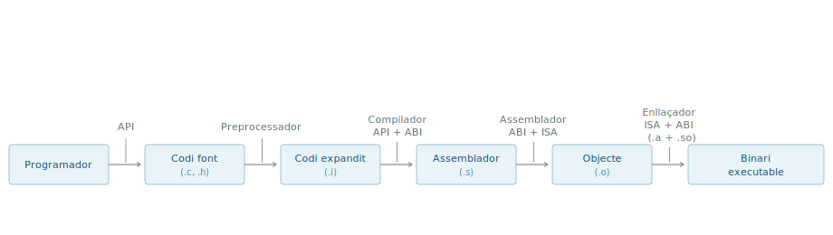
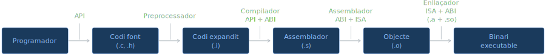
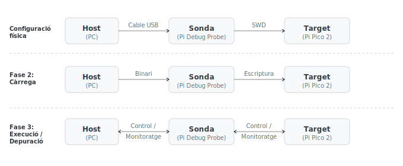
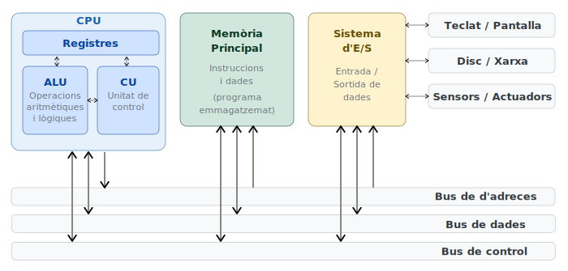
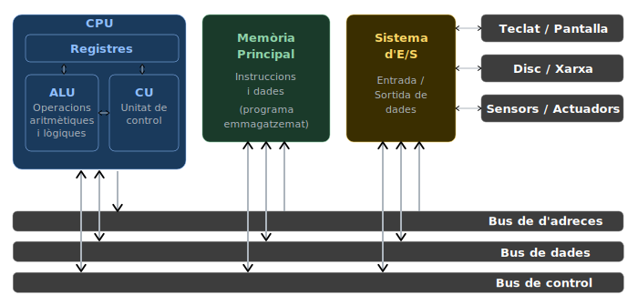

#  {#sec-tema-introduccio}

## La gestió de la complexitat: Capes i interfícies {#sec-capes-interficies}
Un **computador** és un sistema d'una complexitat extraordinària, però que, en el seu nivell més fonamental, només és capaç d'executar **operacions** aritmètiques, lògiques i de control **elementals**. La distància conceptual que separa aquestes instruccions bàsiques de les aplicacions tan sofisticades actuals és tan gran que és impossible dissenyar qualsevol sistema operatiu (SO) o programa modern interactuant directament amb els components físics del processador.

### Nivells d'abstracció {#sec-nivells-abstraccio}

Per gestionar aquesta distància conceptual tan gran i fer viable el disseny de sistemes computacionals, s'aplica el mecanisme de l'**abstracció**. Aquesta estratègia permet estructurar el conjunt del computador, entès com la unió de **maquinari** (***hardware***) i **programari** (***software***), en una **jerarquia de nivells** clarament diferenciats. En aquest model, cada nivell ofereix una descripció simplificada del nivell immediatament inferior, ocultant-ne la complexitat interna i definint interfícies precises que permeten la comunicació entre els diferents components del sistema.

- **Nivell de components físics**: Constitueix el fonament material del computador. Inclou els elements de l'electrònica de base com transistors, resistències, condensadors, díodes, interconnexions físiques, etc.
- **Nivell d'unitats funcionals i lògica digital**: En aquest estadi s'agrupen els components per formar portes lògiques, descodificadors, sumadors, comparadors, busos, etc. Aquest nivell d'abstracció és l'objecte d'estudi de l'assignatura **Introducció als computadors** (**IC**).
- **Nivell de l'arquitectura del repertori d'instruccions** (**ISA**): És la **frontera** crítica entre el **maquinari** i el **programari**. Estableix, entre d'altres, el conjunt d'instruccions que la unitat central de processament (***Central Processing Unit***, **CPU**) és capaç d'executar, el model de memòria i els registres visibles per al programador. A **EC**, la **ISA** de referència és **RISC-V** (vegeu @imp-llenguatges-de-referencia).
- **Nivell de microarquitectura**: És la implementació específica d'una **ISA**. Defineix com s'organitzen i s'interconnecten les unitats funcionals (com l'ALU, els busos o les memòries cau) i com es dissenya el camí de dades (*datapath*) per executar les instruccions. Dos processadors poden implementar la mateixa ISA i comportar-se de manera idèntica per al programador, però tenir microarquitectures completament diferents (per exemple, Intel i AMD amb x86).
- **Nivell de sistema (baix nivell)**: És l'àmbit d'estudi principal d'**Estructura de computadors** (**EC**). Aquí el programari té un control directe sobre els recursos definits per l'ISA. Dins d'aquest nivell trobem:
    - **Llenguatge màquina**: Instruccions codificades en binari que la unitat de control del processador interpreta i executa.
    - **Llenguatge d'assemblador**: Una representació simbòlica del llenguatge màquina que utilitza **mnemònics**. Un programa anomenat **assemblador** s'encarrega de fer la **traducció directa** a codi **binari**.
- **Nivell d'aplicació (alt nivell)**: Nivell on es desenvolupa el programari d'usuari utilitzant llenguatges d'alt nivell com el **C** (**el de referència a EC**), C++ o Rust. Un programa anomenat **compilador** tradueix el codi d'alt nivell (codi font) a instruccions d'assemblador. L'abstracció d'aquest nivell permet al programador gestionar dades i algorismes sense haver de conèixer els detalls de la microarquitectura o el mapa de registres específic.
- **Nivell d'usuari**: Representa el punt de contacte amb l'usuari final, que interacciona amb el sistema mitjançant aplicacions i la **interfície d'usuari (UI)**, ja sigui a través de línies de comandes o d'entorns gràfics.

### Interfícies: Els contractes del sistema {#sec-interficies}

L'abstracció només és efectiva si les interfícies (fronteres) actuen com a contractes rígids que cap de les parts pot violar sense trencar la funcionalitat del sistema. En un **entorn allotjat (*hosted*)** amb **SO**, el cas *full-stack*, que és el més habitual, per exemple, el de Programació I (PRO1), n'hi ha tres:

- ***Application Programming Interface*** (**API**): Contracte a nivell de codi font. Garanteix la portabilitat del programari entre diferents sistemes si es respecten els estàndards (com **ISO C** o POSIX). **Defineix *com* s'ha d'escriure el codi**.

- ***Application Binary Interface*** (**ABI**): Contracte a nivell de binari. És el protocol que defineix com interactuen les peces ja compilades. Estableix les convencions de crida (pas de paràmetres per registres), la gestió de la pila (*stack*) i el format dels fitxers executables. L'ABI depèn del binomi **processador-SO** (ex: GNU/Linux sobre RISC-V). **Defineix com parlen els binaris**.

- ***Instruction Set Architecture*** (**ISA**): Contracte a nivell de maquinari. Defineix el vocabulari d'instruccions, els registres físics i el model de memòria. **Defineix què sap fer el processador**.

::: {#imp-directe-sobre-processador .callout-important}
A **EC**, s'assumeix que es **treballa directament sobre el processador**, si no s'especifica explícitament el contrari. Per tant, recursos vistos en aquest tema, com ara APIs o SO, no estan disponibles per defecte.

El **RARS** és una **excepció important** d'aquesta assumpció, ja que disposa d'un simulador de **syscall**, un recurs bàsic de qualsevol SO, el qual es fa servir en algunes sessions de laboratori.

<!-- TODO reactivar si al final `startup.s` exception handler -->
<!-- Una altra **excepció important**, aquesta derivada de la configuració per defecte del RARS utilitzada a EC (@imp-exception-handler), és l'emulació del mecanisme de l'inici d'execució de programa `__start`. -->
:::

## El cicle de vida del programa: Generació vs. Execució

Per entendre la relació entre les interfícies (**API**, **ABI**, **ISA**), cal diferenciar dues etapes totalment separades en el temps i, sovint, en l'espai (màquines diferents o, fins i tot, arquitectures diferents).

### El flux de generació: La visió del programador

El procés de transformació d’una idea abstracta en un fitxer executable no és un pas directe, sinó una cadena de muntatge (***toolchain***) altament coordinada on intervenen diferents eines de sistema. Aquest flux, que va des de l'escriptura del codi fins a la generació del binari executable, es pot desglossar en quatre (més una) etapes fonamentals on les interfícies API, ABI i ISA actuen com a garanties de compatibilitat:

   0. **Desenvolupament**: El programador escriu el codi font (`.c`, `.h`) d'acord amb l'**API**.
   1. **Preprocessat**: El preprocessador és el primer a actuar. Neteja el text i resol directives (com `#include` o `#define`) per generar el codi expandit (`.i`), una versió completa però encara en llenguatge d'alt nivell.
   2. **Compilació**: El compilador tradueix la lògica de l'alt nivell a un llenguatge de baix nivell anomenat assemblador (`.s`). En aquest punt, el compilador actua com a pont: ha d'entendre l'**API** escrita pel programador i, alhora, començar a aplicar les regles de l'**ABI** per determinar com s'estructuraran les dades en memòria.
   3. **Assemblat**: L'assemblador agafa el fitxer de text (`.s`) i el converteix en Codi Objecte (`.o`). Aquí és on l'**ISA** pren protagonisme, ja que el programari s'ha de traduir a les instruccions específiques del processador diana (x86, ARM, etc.), mantenint l'estructura binària que dicta l'**ABI**.
   4. **Enllaçat** (*linking*): L'Enllaçador és el pas final i crític de síntesi. La seva funció és combinar el codi objecte generat pel programador amb les biblioteques del sistema, tant estàtiques (`.a`) com dinàmiques (`.so`). Per fer-ho, l'enllaçador ha de tenir un coneixement profund de l'**ISA** (per resoldre salts i adreces de memòria) i de l'**ABI** (per assegurar que totes les peces «parlen» el mateix llenguatge binari), i produeix el **binari executable** llest per ser carregat a la memòria.

::: {#fig-flux-compilacio}
::: {.content-visible when-format="html"}
::: {.light-content}

:::
::: {.dark-content}

:::
:::
::: {.content-visible when-format="pdf"}

:::
El flux de generació del programari: les quatre etapes del *toolchain* GCC.
:::

::: {#tip-gcc-vs-clang .callout-tip}
## GCC i Clang
La [**GCC toolchain**](https://gcc.gnu.org/) és l'estàndard *de facto* de la indústria per a sistemes oberts. És un projecte de codi obert que ha evolucionat durant dècades, oferint un suport ampli per a múltiples arquitectures i estàndards de llenguatge.

La [**Clang toolchain**](https://clang.llvm.org/) és una alternativa moderna que ha guanyat popularitat per la seva arquitectura modular i millor suport per a noves característiques del llenguatge C/C++.
:::

### El flux d'execució: La visió del processador
Un cop obtingut el binari, aquest s'ha d'executar. El camí que segueixen les dades depèn de l'entorn de treball:

#### Entorn allotjat (*hosted*)
És el model d'un PC convencional. El binari no és autònom:

1.  El **Sistema Operatiu** carrega el binari a la memòria.
2.  El binari s'executa i, quan necessita interactuar amb l'exterior, fa una crida a l'**ABI** (crida al sistema).
3.  L'**SO** rep la petició i utilitza la **ISA** (instruccions privilegiades) per gestionar el maquinari.

#### Entorn autònom (*bare-metal*)
És el **model** dels sistemes encastats (***embedded** systems*) simples i el d'**EC**:

1.  El binari es carrega directament a la memòria del processador (o via simulador).
2.  El programa té el control total i executa les instruccions de la **ISA** sense intermediaris.
3.  Aquí l'**ABI** no serveix per parlar amb un SO, sinó per garantir que el codi és compatible amb les biblioteques i per interactuar amb el **simulador** (per exemple, mitjançant `ecall` per imprimir per consola).

### El rol de les interfícies

Les interfícies defineixen el binari durant la **generació**, però també regeixen el seu comportament durant l'**execució**. Són el contracte que garanteix que el binari i la màquina (o simulador) s'entenguin en temps real.

#### Les interfícies en la «Visió del Programador» (Generació)
Des del punt de vista del programador **les** interfícies actuen com a **normes de construcció**.

- **API**: El programador escriu `printf()`. El compilador sap què vol dir perquè l'API ho defineix.
- **ABI**: El compilador decideix posar el primer argument a `a0` perquè l'ABI de RISC-V ho mana.
- **ISA**: El compilador tradueix la suma a l'opcode `0x00B50533` perquè l'ISA ho especifica.

#### Les interfícies en la «Visió del Processador» (Execució)
És al processador on les interfícies esdevenen el **protocol de funcionament real**:

- **L'ABI en execució**: Quan el programa fa un `ecall`, el processador s'atura i «mira» el registre `a7`. El simulador (o l'SO) interpreta aquest número basant-se en l'**ABI**. Si l'ABI diu que el codi `1` és «imprimir», el sistema imprimeix. L'ABI és el que permet que el binari i l'entorn es basin en la mateixa «llengua» mentre el programa corre.
- **L'ISA en execució**: És el moment de la veritat. La Unitat de Control del processador llegeix els bits del binari. Si aquests bits no coincideixen amb l'**ISA** del maquinari, el processador no sabrà quines portes lògiques obrir i el sistema fallarà (instrucció il·legal).

<!-- TODO referències al cos principal: sempre, alguna vegada, mai? -->
<!-- La @tbl-impacte-canvi-interficies resumeix l'impacte que tenen els canvis a nivell de cada una de les interfícies. -->

::: {#tbl-impacte-canvi-interficies tbl-colwidths="[15,25,60]" style="width: 90%;" .striped}
| Si canvia la... | El codi s'ha de... | Perquè... |
| :--- | :--- | :--- |
| **API** | Modificar codi + Recompilar | Han canviat les interfícies de les funcions d'alguna biblioteca usada. |
| **ABI** | Recompilar | El binari ha de canviar com gestiona els registres o les crides al sistema. |
| **ISA** | Recompilar | El processador nou no entén els «0s i 1s» de l'antic. |
: Impacte del canvi d'interfícies
:::

### La dualitat de l'entorn: *host* vs. *target* {#sec-host-vs-target}

En el desenvolupament de sistemes de baix nivell i, especialment, en els encastats, on el dispositiu que executarà el codi sol mancar dels recursos necessaris per allotjar eines de programació, cal diferenciar clarament entre dos ordinadors que juguen rols diferents:

1.  **Màquina amfitriona** (***host***):
    - **Què és**: L'ordinador que utilitza el programador per escriure el codi (per exemple, un PC de la facultat o d'un portàtil).
    - **Arquitectura**: Habitualment **x86_64** o **ARM**.
    - **Funció**: Executar l'editor de text i el **compilador**. El compilador és un programa «nadiu» del *Host* que s'encarrega de «fabricar» el binari.
2.  **Màquina destí** (***target***):
    - **Què és**: El sistema on realment s'executarà el programa final.
    - **Arquitectura**: A **EC**, la **ISA** de destí és **RISC-V**.
    - **Funció**: Executar el binari generat pel *Host*. En aquest cas, el *Target* no és una placa física (inicialment), sinó un **simulador** (com el RARS) que reprodueix el comportament d'una CPU RISC-V sobre el *Host*.

#### Per què és important aquesta separació?

- **Incompatibilitat de binaris**: Un binari generat per a RISC-V és una seqüència de bits inintel·ligible per a un processador Intel/AMD. Si s'intenta executar-lo directament al terminal de Linux/Windows, el sistema operatiu advertirà que el format de l'executable és invàlid.
- **El paper del Simulador**: El simulador actua com una «bombolla» de l'arquitectura de destí. El simulador corre en el *Host* (x86), però l'interior de la bombolla entén la **ISA** i l'**ABI** de RISC-V. 
- **Portabilitat del codi font**: El codi en C és l'únic element que «viatja» entre ambdós mons. Es pot compilar el mateix fitxer `.c` per al *Host* (per provar la lògica) o fer **cross-compilation** per al *Target*.

#### Compilació creuada (*cross-compilation*)

S'utilitza un entorn hosted, per exemple, amb arquitectura **x86** i sistema **Linux**, per generar un binari destinat a una arquitectura diferent (per exemple, **RISC-V**). El compilador s'executa en el ***host*** però genera codi per al ***target***.

::: {#tip-toolchain .callout-tip}
## RISC-V GNU Compiler Toolchain
La [RISC-V GNU Compiler Toolchain](https://github.com/riscv-collab/riscv-gnu-toolchain) permet crear codi des de diversos hosts GNU/Linux o macOS per a gran quantitat d'ISAs RISC-V.
:::

Un cop obtingut al host, el binari es carrega al target mitjançant un cable i un protocol apropiat.

#### Depuració creuada (*cross-debugging*)

La depuració s'ha de fer en l'entorn del target, el qual pot ser:

- **Amb simulador**: Un programa (el simulador) en un PC recrea per programari el comportament dels registres i la memòria de la CPU de destí i fa visible els efectes sobre els components del maquinari simulat a través d'interfícies gràfiques. És el cas del **RARS**, el **simulador d'EC**.

- **Amb target real**: El binari s'envia des del host a través d'una placa de desenvolupament (*debugger*) al xip real (el target). D'aquesta manera, el codi s'executa en l'entorn real, amb els seus temps de resposta i perifèrics físics (LEDs, sensors, motors).

### El llenguatge C: El pont de l'abstracció

A **EC**, el llenguatge **C** és l'eina de referència perquè ocupa una posició estratègica única: és prou «alt» per ser llegible, però prou «baix» per reflectir fidelment el que passa a la **ISA**.

#### Origen i dualitat

Creat per Dennis Ritchie als laboratoris Bell (anys 70) per reescriure el sistema operatiu **UNIX**, el C va néixer amb una missió: **substituir el llenguatge d'assemblador**.

- **Com a llenguatge d'alt nivell** (API): Ofereix estructures de control (`if`, `while`) i tipus de dades que permeten programar sense pensar en processadors concrets.
- **Com a «assemblador portàtil»** (ABI/ISA): Permet manipular directament adreces de memòria mitjançant **punters**. Una variable en C té una correspondència quasi directa amb una posició de memòria o un registre de l'ISA.

#### Control del maquinari amb C

A diferència de llenguatges com Java o Python, el C permet accedir a capes molt més pròximes al maquinari:

1. **Gestió de memòria**: Mitjançant els punters, el programador decideix exactament on resideixen les dades. Això és vital en sistemes **bare-metal** per accedir a registres de control del maquinari que estan «mapats» en memòria (*Memory-Mapped I/O*).
2. **Alineament i estructures**: El C permet definir com s'empaqueten els bits (estructures `struct`). L'**ABI** determina com s'ordenen aquests bytes en memòria, i el C té les eines per respectar aquest ordre.
3. **Eficiència**: Un bon compilador tradueix el C a **ISA** d'una manera extremadament eficient.

#### La dependència de l'entorn

Tot i que el codi C és portable, el seu comportament final depèn de l'**ABI**:

- La mida d'un `int` (16, 32 o 64 bits) no la estableix el llenguatge, sinó l'ABI del sistema on s'executarà el programa.
- El pas de paràmetres a les funcions el gestiona el compilador seguint l'ABI, però el programador de C ha de ser conscient d'aquestes regles quan interactua amb codi escrit directament en **assemblador**.

### Traducció: De C al llenguatge de màquina {#sec-traduccio-c-asm}

El procés de traducció no és un pas únic, sinó una cadena de transformacions (coneguda com a *toolchain*) on cada etapa acosta el codi una mica més al maquinari. **El compilador de referència a EC és el GCC**.

#### Les quatre etapes del GCC

1.  **Preprocessat** (`cpp`):
    - Gestiona les directives que comencen per `#` (com `#include` o `#define`).
    - **Resultat**: Un fitxer de text amb tot el codi «expandit», però encara en C.
2.  **Compilació** (`cc1`):
    - És l'etapa més complexa. El compilador analitza la lògica del C i la tradueix a **llenguatge d'assemblador** específic per a una **ISA** (ex. RISC-V).
    - Aquí és on el compilador aplica les regles de l'**ABI** per decidir quins registres usar per a cada variable.
    - **Resultat**: Un fitxer de text (`.s`) llegible per humans, però amb instruccions de **mnemònics** (ex. `addi`, `lw`).
3.  **Assemblat** (`as`):
    - Tradueix els **mnemònics** de l'assemblador a **codi màquina** (binari pur).
    - **Resultat**: Un fitxer objecte (`.o`). Són 0s i 1s, però encara no es pot executar perquè les adreces de les funcions externes (com `printf`) encara no estan resoltes.
4.  **Enllaçat** (`ld`):
    - Combina el fitxer objecte amb altres biblioteques i resol les adreces de memòria definitives.
    - **Resultat**: L'**Executable final**, llest per ser carregat a la memòria del processador o simulador.

#### El llenguatge d'assemblador: La visió de l'ISA {#sec-visio-isa}

**La compilació és rellevant a EC**, ja que l'assemblador és la representació textual de la **ISA**.

::: {#tip-traduccio-c-asm .callout-tip}
## Traducció de **C** a **assemblador RISC-V**
```{.c filename="C"}
int suma(int a, int b) {
    return a + b;
}
```

```{.s filename="RV32I"}
# L'ABI de RISC-V diu que els arguments van a a0 i a1
suma:
    add a0, a0, a1    # Instrucció de l'ISA: a0 <- a0 + a1
    ret               # Pseudoinstrucció: retorna el control al cridant
```

En aquest exemple, el compilador ha seguit les regles de l'**ABI** per decidir que els paràmetres `a` i `b` es passen a través dels registres `a0` i `a1` (registres d'argument). La instrucció `add` és una operació definida per la **ISA** de RISC-V que realitza la suma i en deixa el resultat a `a0` (registre de retorn). Finalment, la instrucció `ret` és una pseudoinstrucció que el compilador tradueix a un salt incondicional a l'adreça de retorn.

:::

:::: {#wrn-picopi .callout-warning collapse=true}
## Treballant amb maquinari real: [Raspberry Pi Pico 2 W](https://www.raspberrypi.com/products/raspberry-pi-pico-2/) + [Raspberry Pi Debug Probe](https://www.raspberrypi.com/products/debug-probe/)

Un **microcontrolador** és un sistema informàtic complet integrat en un sol xip de silici, dissenyat específicament per controlar tasques concretes en sistemes encastats. A diferència d'un **microprocessador** convencional (com el d'un PC), que només conté la Unitat Central de Processament (CPU) i necessita components externs per funcionar, el microcontrolador incorpora dins del mateix encapsulat la memòria (RAM i Flash), els circuits de rellotge i una gran varietat de perifèrics d'Entrada/Sortida (com GPIO, UART o ADC).

El **RP2350** és un microcontrolador de **Raspberry Pi** (RP) de tipus *System-on-chip* (SoC) que inclou dos nuclis ARM Cortex-M33 i dos nuclis **Hazard3** basats en la **ISA RISC-V**. El programador pot triar quina arquitectura utilitzar en temps de compilació.

La **[Raspberry Pi Pico 2](https://www.raspberrypi.com/products/raspberry-pi-pico-2/)** és una placa de desenvolupament basada en el xip **RP2350**. Com a plataforma d'experimentació exposa els pins del microcontrolador per connectar-hi sensors, actuadors i depuradors.

La **[Raspberry Pi Debug Probe](https://www.raspberrypi.com/products/debug-probe/)** és una sonda de depuració (***debug probe***). La interfície Serial Wire Debug (**SWD**) li permet controlar la CPU del target, carregar-hi binaris i inspeccionar registres o memòria en temps real. L'estàndard **CMSIS-DAP**, compatible amb la majoria d'eines de depuració de codi obert com OpenOCD o GDB, li permet la interacció amb el PC del desenvolupador.

::: {#fig-picopi-fases}
::: {.content-visible when-format="html"}
::: {.light-content}

:::
::: {.dark-content}

:::
:::
::: {.content-visible when-format="pdf"}

:::
Configuració física i fases d'ús del conjunt Host + Sonda (*Pi Debug Probe*) + Target (*Pi Pico 2*).
:::

- **Host** (**PC**):
    - Executa el programa **depurador** ([GDB/OpenOCD](https://openocd.org/)), que, a través de CMSIS-DAP, dona **ordres** a la sonda i en rep les **respostes**.

- **Sonda** (**Pi Debug Probe**):
    - Actua de **pont**. Tradueix els missatges del host a senyals elèctrics de baix nivell que el target pot entendre i viceversa.

- **Target** (**Pi Pico 2**):
    - És on resideix la **ISA de RISC-V** que **executa** el binari.

**Fase 1: Creació**

- **Host** (**PC**):
    - Genera el binari ([riscv-gnu-toolchain](https://github.com/riscv-collab/riscv-gnu-toolchain)).

**Fase 2: Càrrega** (***Flashing*** / ***Deployment***)

- **Host** (**PC**):
    - El depurador envia el binari a la sonda.

- **Target** (**Pi Pico 2**):
    - Rep i emmagatzema a la memòria permanent (***flash***) el binari.

**Fase 3: Execució** / **Depuració** (***Runtime*** / ***Debugging***)

- **Host** (**PC**):
    - Envia ordres com «Atura't (`breakpoint`)», «Executa la següent instrucció (`step`)» o «Escriu el valor `5` al registre `a0`».

- **Target** (**Pi Pico 2**):
    - Respon enviant la informació en temps real: «Estic aturat a l'adreça `0x100`», «El registre `t0` val `42`» o «S'ha produït un error de memòria».

::::

### C vs. C++

La majoria d'estudiants arriben a EC havent après **C++**, el llenguatge de referència a PRO1. Tot i que el C++ és un descendent directe del C i en conserva gairebé tota la sintaxi bàsica, la seva orientació és radicalment diferent de la requerida a **EC**.

#### Diferències fonamentals: Què es «perd» en passar a C?

El pas de C++ a C és un exercici de **simplificació**. En C no existeixen les capes d'abstracció d'alt nivell que faciliten la vida en programació de programari complex:

- **Sense Classes ni Objectes**: El C és un llenguatge **procedimental**. No hi ha `class`, `public`, `private` ni herència. Les dades s'agrupen en `struct` (estructures de dades) i les funcions operen sobre elles de manera externa.
- **Sense Standard Template Library (STL)**: No hi ha `std::vector`, `std::stack` o `std::map`. En C, si, per exemple, es vol una llista enllaçada, cal programar-la gestionant els punters manualment.
- **Gestió manual de l'E/S**: No hi ha *streams* (`cin >>`, `cout <<`), sinó funcions de biblioteca com `scanf` i `printf`. Això obliga a especificar el **format de les dades** (`%d` per a enters, @tip-abstraccio-transparencia), el qual està íntimament lligat a la manera com es representen en bits.
- **Gestió explícita de la memòria**: En C++ sovint la memòria s'allibera automàticament (destructors). En C, cada `malloc()` (reserva) requereix un `free()` (alliberament) manual.

#### Per què C i no C++ a Estructura de Computadors?

A **arquitectura de computadors** s'usa **C** com a referència perquè dona un **accés al maquinari** molt més **transparent**:

1.  **Correspondència directa amb l'ISA**: El C++ introdueix mecanismes com el polimorfisme o el manteniment d'objectes que generen molt «codi ocult» en el binari. En C, gairebé cada línia de codi té una traducció directa i previsible a **instruccions de l'ISA**. És el llenguatge perfecte per aprendre com funciona el processador per dins.
2.  **Control de l'ABI**: L'**ABI** de C és l'estàndard universal. Gairebé tots els sistemes operatius i simuladors estan dissenyats per entendre's amb el binari que genera el C. El C++ té una ABI molt més complexa (especialment pel que fa al «mangling» de noms de funcions) que dificultaria molt les pràctiques de baix nivell.
3.  **Determinisme**: En sistemes de baix nivell (com els **encastats** o el **bare-metal**), cal saber exactament quant de temps triga una operació i quanta memòria ocupa. El C no té «sorpreses» en temps d'execució; el C++ pot tenir sobrecàrregues ocultes que un microcontrolador petit no podria gestionar.
4.  **Accés al maquinari**: El C permet tractar una adreça de memòria com si fos una variable. Això és el que es fa per parlar amb els perifèrics del simulador.

::: {#tip-abstraccio-transparencia .callout-tip}
## L'abstracció vs. la transparència

Imprimir un número enter en base decimal per pantalla pot semblar una tasca trivial, però implica diversos conceptes d'**ABI** i **format de dades**:

En C++, l'èmfasi en l'abstracció de l'*stream*:
```{.cpp filename="C++"}
int n = 42;
std::cout << n;
```
- **Què passa aquí?** El programador no diu *com* és el número. L'objecte `cout` «endevina» que `n` és un enter (gràcies a la sobrecàrrega d'operadors) i decideix internament com transformar els bits de `n` en caràcters ASCII.
- **Problema per a EC**: Hi ha molta «màgia» oculta. Per exemple, tant el pas de paràmetres com la gestió del tipus de dada a nivell de registre resten ocults.

En C, l'èmfasi en la transparència del format:
```{.c filename="C"}
int n = 42;
printf("%d", n);
```
- **Què passa aquí?** C obliga a ser explícit:
    1.  **`"%d"`**: Indica a la funció exactament com ha d'interpretar els bits. Com a enter decimal amb signe, en aquest cas. O `%x`, per imprimir-lo en hexadecimal.
    2.  **`n`**: Passa el valor directament.
- **Avantatge per a EC**: Aquesta estructura de `printf` es tradueix gairebé directament a l'**ABI** de RISC-V: el punter a la cadena de format anirà al registre `a0` i el valor de `n` anirà al registre `a1`. **No hi ha màgia, hi ha registres.**

:::

:::: {#wrn-c-cpp .callout-warning collapse=true}
## Exemple de correspondències entre C i C++
::: {style="text-align: center; width: 90%;"}
| Concepte | C++ (PRO1) | C (EC) | Per què en C? |
| :--- | :--- | :--- | :--- |
| **Sortida de dades** | `cout << x;` | `printf("%d", x);` | Cal explicitar el format de les dades (bits). |
| **Entrada de dades** | `cin >> x;` | `scanf("%d", &x);` | Obliga a usar l'adreça de memòria (`&`). |
| **Reserva de memòria** | `new int[10];` | `malloc(10 * sizeof(int));` | Cal gestionar la llargada exacta en bytes. |
| **Alliberar memòria** | `delete[] v;` | `free(v);` | Gestió manual del *heap* (@sec-estructura-memoria). |
:::
::::

### Llenguatges interpretats

Mentre que C es **compila** (es tradueix tot el codi font abans d'executar-lo), altres llenguatges com Python es **interpreten**: un programa anomenat **intèrpret** llegeix el codi font i el tradueix a instruccions de la ISA *mentre* el programa corre.

**Els llenguatges interpretats no són apropiats per EC** perquè, en general, fan molt més opacs els detalls d'arquitectura, que és precisament l'àmbit d'interès de l'assignatura.

## Arquitectura física: El model de Von Neumann {#sec-von-neumann}

La pràctica totalitat dels computadors actuals (des d'un supercomputador fins al processador d'un microones) segueixen l'arquitectura proposada per **John von Neumann** l'any 1945. El trencament conceptual més important d'aquest model és el concepte de **programa emmagatzemat**.

### El concepte de programa emmagatzemat: Instruccions i dades a la mateixa memòria

Abans de Von Neumann, per «reprogramar» una màquina calia canviar cables i interruptors físicament. En el model de Von Neumann:

- Les **instruccions** (el codi binari generat a la @sec-visio-isa) i les **dades** (els nombres que s'operen) resideixen al mateix lloc: la **Memòria Principal**.
- El processador llegeix la memòria, interpreta què és una instrucció i l'executa.

### Els components del model

L'arquitectura es divideix en quatre blocs funcionals connectats entre si:

1.  **Unitat central de processament** (**CPU**): El «cervell» que es divideix en:
    - **Unitat aritmeticològica** (**ALU**): On es fan les operacions matemàtiques i lògiques.
    - **Unitat de control** (**CU**): L'orquestra que llegeix la memòria i diu a la resta de components què han de fer.
2.  **Memòria principal** (**MP**): Un vector gegant de cel·les on cada posició té una **adreça** única.
3.  **Sistema d'entrada/sortida** (**I/O**): Permet la comunicació amb el món exterior (teclat, pantalla, disc dur).
4.  **Busos**: Les «autopistes» de dades que connecten tots els components.

::: {#fig-von-neumann}
::: {.content-visible when-format="html"}
::: {.light-content}

:::
::: {.dark-content}

:::
:::
::: {.content-visible when-format="pdf"}

:::
Arquitectura de Von Neumann: CPU (ALU, CU i Registres), Memòria principal i Sistema d'E/S interconnectats pels Busos de dades, d'adreces i de control. Sovint se'n representa una versió simplificada amb un únic bus bidireccional que connecta CPU, Memòria i Sistema d'E/S.
:::

### El cicle d'instrucció (*fetch-decode-execute*)

La Unitat de Control repeteix indefinidament tres passos:

1.  **Captura** (***fetch***): Es llegeix la següent instrucció de la memòria (l'adreça està guardada en un registre especial anomenat **Program Counter** o **PC**).
2.  **Descodificació** (***decode***): La Unitat de Control analitza els bits de la instrucció per saber què cal fer (és una suma? és un salt? Cal llegir dades de la memòria?).
3.  **Execució** (***execute***): S'activen els circuits de l'ALU o es mouen dades entre registres i memòria.

::: {#wrn-coll .callout-warning collapse=true}
## El «Coll d'ampolla» del model de Von Neumann

Com que les dades i les instruccions viatgen pel mateix bus cap a la memòria, el processador sovint ha d'esperar que la memòria li doni el que demana. Aquest límit de velocitat es coneix com el **coll d'ampolla de Von Neumann**.
:::

## Codificació de nombres naturals en base 2

Un nombre natural $x_u$ de $n$ bits es representa com una cadena de bits $X = X_{n-1} \ldots X_1 X_0$, on cada bit $X_i \in \{0, 1\}$.

### Interpretació: bits → natural

Donat un vector de bits $X$, el natural representat és:

$$x_u = \sum_{i=0}^{n-1} X_i \cdot 2^i$$ {#eq-natural-interpretacio}

::: {#tip-natural-interpretacio .callout-tip}
## Interpretació de bits com a natural

**Pregunta**: S'ha d'interpretar $X = 0001\,1001_2$ (8 bits) com a natural.

**Solució**:

$$x_u = 1{\cdot}2^4 + 1{\cdot}2^3 + 1{\cdot}2^0 = 16 + 8 + 1 = 25$$

**Resposta**: $x_u = 25$
:::

### Representació: natural → bits

Donat un natural $x_u$, la seva representació en $n$ bits s'obté dels residus de dividir successivament $x_u$ entre 2, de menor a major pes.

::: {#tip-natural-representacio .callout-tip}
## Representació d'un natural en binari

**Pregunta**: S'ha de representar $x_u = 25$ amb 8 bits.

**Solució**:

| Divisió | Quocient | Residu (bit) |
| :--- | :---: | :---: |
| $25 / 2$ | $12$ | $X_0 = 1$ |
| $12 / 2$ | $6$ | $X_1 = 0$ |
| $6 / 2$ | $3$ | $X_2 = 0$ |
| $3 / 2$ | $1$ | $X_3 = 1$ |
| $1 / 2$ | $0$ | $X_4 = 1$ |
| $0 / 2$ | $0$ | $X_5 = 0$ |
| $0 / 2$ | $0$ | $X_6 = 0$ |
| $0 / 2$ | $0$ | $X_7 = 0$ |

**Resposta**: $X = 0001\,1001_2$

Un cop el quocient és zero, les divisions restants només afegeixen zeros a l'esquerra (extensió de zeros, vegeu @sec-extensio-zeros).
:::

### Rang de representació

Amb $n$ bits es poden representar $2^n$ naturals diferents:

$$x_u \in [0,\ 2^n - 1]$$ {#eq-rang-naturals}

Per exemple, amb 8 bits: $x_u \in [0, 255]$.

### Extensió de zeros {#sec-extensio-zeros}

Per representar un natural de $n$ bits amb $m > n$ bits, s'afegeixen zeros a l'esquerra. El valor representat no canvia.

::: {#tip-extensio-zeros .callout-tip}
## Extensió de zeros

El natural $x_u = 25$ es representa amb 8 bits com $0001\,1001_2$.

Amb 16 bits: $0000\,0000\,0001\,1001_2$. El valor és el mateix.
:::

## Codificació de nombres enters en base 2 {#sec-codificacio-enters}

Un nombre enter $x_s$ de $n$ bits es representa com una cadena de bits $X = X_{n-1} \ldots X_1 X_0$, on el bit de més pes $X_{n-1}$ indica el signe: $0$ si positiu, $1$ si negatiu.

Els enters positius es codifiquen igual que els naturals equivalents.

### Enters en complement a 2 (Ca2) {#sec-enters-en-ca2}

És la codificació estàndard dels enters en els processadors moderns, inclòs
**RISC-V**. El rang representable amb $n$ bits és:

$$x_s \in [-2^{n-1},\ 2^{n-1} - 1]$$ {#eq-rang-ca2}

Per exemple, amb 8 bits: $x_s \in [-128, +127]$.

#### Interpretació: bits → enter

$$x_s = -X_{n-1} \cdot 2^{n-1} + \sum_{i=0}^{n-2} X_i \cdot 2^i$$ {#eq-ca2-interpretacio}

::: {#tip-ca2-interpretacio .callout-tip}
## Interpretació de bits com a enter en Ca2

Interpretar $X = 1100\,1101_2$ (8 bits) com a enter en Ca2.

**Solució**: Aplicant @eq-ca2-interpretacio:

$$x_s = -1{\cdot}2^7 + 1{\cdot}2^6 + 1{\cdot}2^3 + 1{\cdot}2^2 + 1{\cdot}2^0$$
$$= -128 + 64 + 8 + 4 + 1 = -51$$

**Resposta**: $x_s = -51$
:::

#### Representació: enter → bits

Per a enters **positius**, el procediment és idèntic al dels naturals (@sec-extensio-zeros).

Per a enters **negatius**, s'aplica la **regla del canvi de signe**: es complementen tots els bits i se suma 1.

::: {#tip-ca2-representacio-negatiu .callout-tip}
## Representació d'un enter negatiu en Ca2

Representar $x_s = -51$ amb 8 bits.

**Solució**: Representem l'oposat $+51$ per divisions successives:

$$51 \rightarrow 0011\,0011_2$$

Apliquem el canvi de signe (complement i suma 1):

$$\overline{0011\,0011_2} = 1100\,1100_2$$
$$1100\,1100_2 + 1 = 1100\,1101_2$$

**Resposta**: $X = 1100\,1101_2$
:::

#### Extensió de signe

Per representar un enter en Ca2 de $n$ bits amb $m > n$ bits, es replica el bit de signe $X_{n-1}$ a l'esquerra. El valor representat no canvia.

::: {#tip-extensio-signe .callout-tip}
## Extensió de signe

L'enter $x_s = -51$ es representa amb 8 bits com $1100\,1101_2$.

Amb 16 bits: $1111\,1111\,1100\,1101_2$. El valor és el mateix.
:::

### Enters en excés

La codificació en excés assigna la representació $000\ldots0_2$ al valor més negatiu i $111\ldots1_2$ al més positiu, de manera que l'ordre de les representacions coincideix amb l'ordre numèric dels enters. Això permet **comparar enters amb el mateix circuit que compara naturals**.

Donada una constant **excés** $= 2^{n-1} - 1$:

$$x_s = x_u - \text{excés}$$ {#eq-exces-interpretacio}
$$x_u = x_s + \text{excés}$$ {#eq-exces-representacio}

::: {#tip-exces .callout-tip}
## Interpretació i representació en excés

Amb $n = 8$ bits, excés $= 2^7 - 1 = 127$.

**Interpretació**: $X = 1000\,0000_2 \Rightarrow x_u = 128 \Rightarrow x_s = 128 - 127 = +1$

**Representació**: $x_s = -127 \Rightarrow x_u = -127 + 127 = 0 \Rightarrow X = 0000\,0000_2$
:::

::: {#imp-exces-coma-flotant .callout-important}
A **EC**, la codificació en excés s'utilitza per representar l'exponent dels nombres en **coma flotant** (@sec-tema-coma-flotant).
:::

### Altres codificacions

::: {#wrn-signe-magnitud .callout-warning collapse=true}
## Enters en signe-magnitud

El bit de més pes indica el signe ($0$ positiu, $1$ negatiu) i els $n-1$ bits restants representen el valor absolut com un natural.

**Rang**: $x_s \in [-(2^{n-1}-1),\ +2^{n-1}-1]$

**Inconvenients**: doble representació del zero ($+0$ i $-0$) i circuit de suma diferent al dels naturals. No s'usa en processadors moderns.
:::

::: {#wrn-codificacio-enters-ca1 .callout-warning collapse=true}
## Enters en complement a 1 (Ca1)

L'enter negatiu oposat de $x_s$ s'obté complementant tots els bits de la seva representació.

**Rang**: $x_s \in [-(2^{n-1}-1),\ +2^{n-1}-1]$

**Inconvenients**: doble representació del zero i algorisme de suma diferent al dels naturals. No s'usa en processadors moderns.
:::