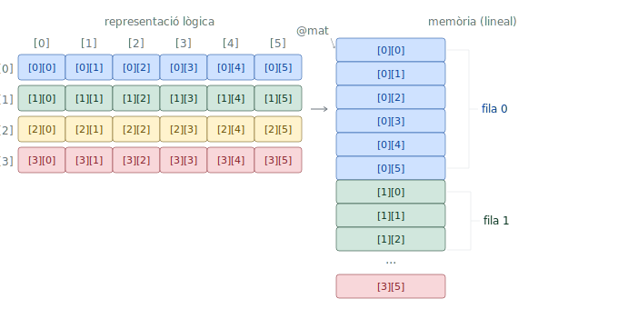
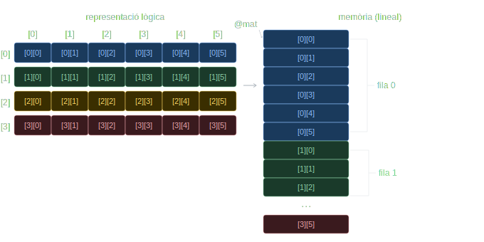
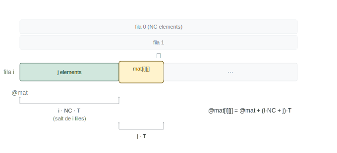
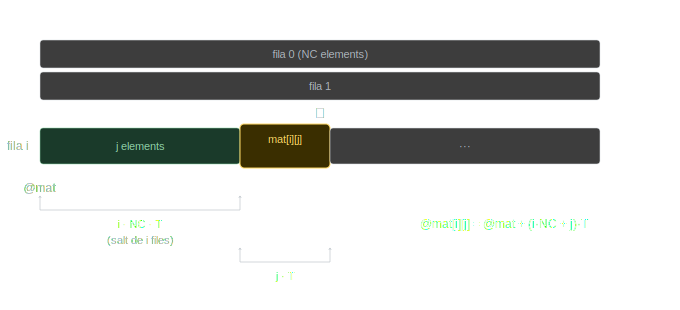
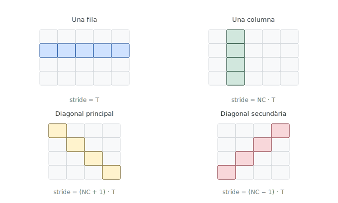
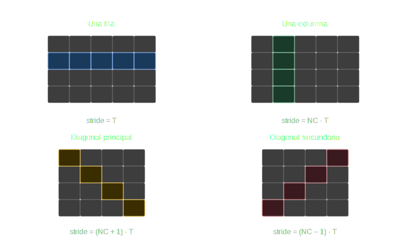

# Tema 4: Aritmètica entera i matrius {#sec-tema-enters-matrius}


## Suma, resta i canvi de signe

::: {#nte-instruccions-add-sub .callout-note}
## RV32I ISA — Instruccions de suma i resta
| Mnemònic | Operands | Operació | Nom | Tipus |
| :--- | :--- | :--- | :--- | :---: |
| `add` | `rd, rs1, rs2` | `rd` ← `rs1` + `rs2` | *Add* | R |
| `sub` | `rd, rs1, rs2` | `rd` ← `rs1` - `rs2` | *Subtract* | R |
: {tbl-colwidths="[5,20,35,35,5]"}
:::

::: {#nte-pseudoinstruccions-neg .callout-note}
## RV32I ISA — Instruccions de desplaçament lògic
| Mnemònic | Operands | Operació | Nom | Expansió |
| :--- | :--- | :--- | :--- | :---: |
| `neg` | `rd, rs` | `rd` ← -`rs` | *Negate* | `sub rd, x0, rs` |
: {tbl-colwidths="[5,20,35,35,5]"}
:::

## Sobreeiximent en suma i resta d'enters {#sec-suma-resta-enters}

El **rang** de representació dels enters en Ca2 (@sec-enters-en-ca2) amb $n$ bits és $[-2^{n-1},\ 2^{n-1}-1]$ (@eq-rang-ca2). Es produeix **sobreeiximent** (***overflow***) en una operació quan el resultat exacte no pertany a aquest rang; en aquest cas, el resultat calculat amb $n$ bits no és correcte.

### Condicions d'sobreeiximent

Per a la **suma** $s = a + b$, es produeix sobreeiximent **si i només si els dos operands són del mateix signe i el resultat és de signe diferent**.

Per a la **diferència** $d = a - b$, es produeix sobreeiximent **si i només si** la diferència és del mateix signe que el subtraend $b$ però de signe diferent que el minuend $a$**.

::: {#wrn-sobreeiximent-demostracio .callout-warning collapse=true}
## Demostració de les condicions d'sobreeiximent en Ca2

Considerem la suma exacta $s = a + b$, on $a$ i $b$ estan representats per les cadenes de bits $A = A_{n-1}\ldots A_0$ i $B = B_{n-1}\ldots B_0$. La suma exacta sempre es pot representar amb $n+1$ bits com $S = S_n\,S_{n-1}\ldots S_0$.

**Cas 1 — Signes oposats**: si $a < 0$ i $b \geq 0$, llavors $a \leq a+b < b$, de manera que $s$ sempre és representable amb $n$ bits.
No hi ha sobreeiximent.

**Cas 2 — Mateix signe**: la suma exacta ha de ser del mateix signe que els operands, de manera que $S_n = A_{n-1} = B_{n-1}$. La cadena truncada $S' = S_{n-1}\ldots S_0$ és la representació correcta de $s$ si i només si $S_{n-1} = S_n$, és a dir, si $S_{n-1} = A_{n-1} = B_{n-1}$. Si $S_{n-1} \neq A_{n-1}$, el resultat truncat és incorrecte: hi ha sobreeiximent.

Per a la diferència $d = a - b$, es pot aplicar la mateixa regla a l'expressió $a = d + b$.
:::

### Detecció del sobreeiximent per maquinari

En un sumador amb propagació de *carry* de $n$ bits, es produeix sobreeiximent quan el *carry* d'entrada al bit de més pes difereix del *carry* de sortida:

$$
v = c_{n-1} \oplus c_n
$$ {#eq-sobreeiximent-hardware}

::: {#wrn-sobreeiximent-maquinari .callout-warning collapse=true}
## Detecció d'sobreeiximent per maquinari: el sumador amb propagació de l'arrossegament

Un sumador de $n$ bits es construeix amb una cadena de $n$ **sumadors complets** (*full-adders*). Cada sumador complet rep el bit $a_i$, el bit $b_i$ i el bit d'arrossegament d'entrada (*carry-in*) $c_i$, i produeix el bit de suma $s_i = a_i \oplus b_i \oplus c_i$ i el bit d'arrossegament de sortida (*carry-out*) $c_{i+1} = (a_i \oplus b_i) \land c_i \lor a_i \land b_i$.

Al darrer sumador complet (bit de més pes), el *carry-in* és $c_{n-1}$ i el *carry-out* és $c_n$. El sobreeiximent es detecta amb una sola porta lògica
afegida al darrer sumador: $v = c_{n-1} \oplus c_n$.
:::

### Detecció del sobreeiximent per programari {#sec-sobreeiximent-programari}

Donada la suma $s = a + b$ d'enters de 32 bits, la condició d'sobreeiximent és:

$$
v = \overline{(A_{31} \oplus B_{31})} \land (A_{31} \oplus S_{31})
$$ {#eq-sobreeiximent-software}

és a dir, sobreeiximent si els operands **tenen el mateix signe** i el resultat **té signe diferent**.

::: {#tip-sobreeiximent-programari .callout-tip}
## Càlcul de la condició d'sobreeiximent per programari

Suposant que els enters `a`, `b`, `s` estan a `t0`, `t1`, `t2`, i que s'ha
executat `add t2, t0, t1`:

```{.s filename="RV32I"}
        xor     t3, t0, t1      # A xor B  (bit 31: 0 si mateix signe)
        not     t3, t3          # ~(A xor B), vegeu @nte-pseudoinstruccio-not
        xor     t4, t0, t2      # A xor S  (bit 31: 1 si signes diferents)
        and     t3, t3, t4      # condició d'sobreeiximent als 32 bits
        srli    t3, t3, 31      # desplaça bit 31 a la posició 0
                                # t3 = 1 si sobreeiximent, 0 si no
```
:::

::: {#imp-sobreeiximent-riscv .callout-important}
A **RISC-V**, totes les instruccions d'aritmètica entera **ignoren el sobreeiximent**: el resultat es trunca silenciosament als 32 bits de menys pes, sense excepció ni indicador. La detecció d'sobreeiximent, si cal, és responsabilitat del programari (@sec-sobreeiximent-programari).
:::

## Multiplicació entera {#sec-multiplicacio-entera}

### Algorisme

L'algorisme de multiplicació entera es basa en el mateix principi que la multiplicació manual: calcular productes parcials i acumular-los. Per a enters amb signe, es treballa amb els valors absoluts i s'ajusta el signe del resultat al final.

L'algorisme per calcular el producte $z = x \times y$ d'enters és:

1. Calcular els valors absoluts $|x|$ i $|y|$.
2. Multiplicar els valors absoluts (producte de naturals).
3. Si els operands tenen signes **diferents**, canviar el signe del resultat.

#### Multiplicació de naturals

Per multiplicar dos naturals en base 2, s'obtenen tants **productes parcials** com bits té el multiplicador: el producte parcial $i$ és el multiplicand desplaçat $i$ posicions a l'esquerra si el bit $i$ del multiplicador és 1, o zero si és 0. La suma de tots els productes parcials és el resultat.

::: {#tip-multiplicacio-naturals .callout-tip}
## Algorisme de multiplicació de naturals en base 2

Multiplicar $x = 1010_2$ ($10_{10}$) per $y = 1101_2$ ($13_{10}$):

```{.default}
      1010    multiplicand (x)
    × 1101    multiplicador (y)
    ------
      1010    producte parcial: x × 1 (bit 0)
     0000     producte parcial: x × 0 (bit 1)
    1010      producte parcial: x × 1 (bit 2)
   1010       producte parcial: x × 1 (bit 3)
---------
  10000010    resultat: 130₁₀ ✓
```
:::

### Circuit seqüencial de multiplicació {#sec-circuit-multiplicacio}

Per evitar guardar tots els productes parcials simultàniament, el circuit els va acumulant a mesura que es calculen en un registre acumulador **P** de $2n$ bits, inicialitzat a zero.

El circuit disposa de tres registres:

* **MD** ($2n$ bits): conté el multiplicand, inicialitzat amb $x$ a la part baixa i zeros a la part alta. Es desplaça una posició a l'esquerra
  a cada iteració.
* **MR** ($n$ bits): conté el multiplicador $y$. Es desplaça una posició a la dreta a cada iteració; el bit de menys pes s'usa per decidir si
  sumar o no.
* **P** ($2n$ bits): acumulador del producte. S'inicialitza a zero i s'hi suma MD si el bit de menys pes de MR és 1.

<!-- TODO figura circuit multiplicador seqüencial -->
{#fig-TODO1 width="40%"}

::: {#thm-multiplicacio-secuencial}
Multiplicació seqüencial d'enters de 32 bits, on $x$ multiplicand, $y$ multiplicador i $z$ el resultat.

```{.default filename="Pseudocodi"}
// Inicialització
MD[31:0] = x;  MD[63:32] = 0
MR = y
P = 0

per i = 1 fins a 32:
    si MR[0] == 1: P = P + MD
    MD = MD << 1
    MR = MR >> 1

z = P
```
:::

::: {#tip-seguiment-multiplicacio .callout-tip}
## Seguiment del circuit multiplicador (4 bits)

Multiplicar $x = 1010_2$ per $y = 1101_2$:

| Iteració | P (acumulador) | MD (multiplicand) | MR (multiplicador) |
| :---: | :---: | :---: | :---: |
| inicial | `0000 0000` | `0000 1010` | `1101` |
| 1 | `0000 1010` | `0001 0100` | `0110` |
| 2 | `0000 1010` | `0010 1000` | `0011` |
| 3 | `0011 0010` | `0101 0000` | `0001` |
| 4 | `1000 0010` | `1010 0000` | `0000` |

Resultat: $P = 10000010_2 = 130_{10}$ ✓
:::

Aquest circuit tarda un mínim de 33 cicles per obtenir el producte (32 iteracions més la inicialització).

::: {#wrn-circuit-multiplicacio-combinacional .callout-warning collapse=true}
## Circuit combinacional de multiplicació

Una alternativa al circuit seqüencial és un **circuit combinacional** que calcula tots els productes parcials en paral·lel i els suma amb una cadena de sumadors:

$$Z = X \cdot y_0 + (X \cdot y_1) \ll 1 + \ldots + (X \cdot y_{31}) \ll 31$$

Això requereix 31 sumadors disposats en sèrie (de 33 a 63 bits). El retard total és aproximadament la suma dels retards dels 31 sumadors, cosa que no representa una millora substancial respecte del circuit seqüencial.

No obstant, si es reestructuren les sumes en forma d'**arbre**, es pot reduir el retard a l'equivalent de 5 sumadors (aproximadament 6 vegades més ràpid que la versió en sèrie), ja que moltes sumes es fan en paral·lel.

<!-- TODO figura circuit multiplicador en arbre -->
{#fig-TODO2 width="60%"}

:::

### Instruccions de multiplicació (extensió M) {#sec-extensio-m}

Com s'ha vist a @sec-multiplicacio-potencies-2, `slli` permet multiplicar per potències de 2 de manera eficient; és la solució adequada per escalar índexs de vectors quan la mida de l'element és 1, 2, 4 o 8 bytes (@imp-ec-sll-acces-vector). Per al cas general, però, cal una instrucció de multiplicació d'enters: per exemple, per accedir a un element qualsevol d'una matriu, cal calcular `i*NC`, on el nombre de columnes `NC` no té per què ser una potència de 2.

Aquí és on es manifesta la potència del disseny modular de RISC-V (@sec-riscv): l'extensió **M** (@sec-extensio-m-t2) afegeix instruccions de multiplicació i divisió entera per maquinari. Per activar-la, cal afegir `m` al paràmetre `-march` del compilador: `-march=rv32im`.

::: {#nte-rv32im-instruccions-multiplicacio .callout-note}
## RV32IM ISA — Instruccions de multiplicació entera

| Mnemònic | Operands | Operació | Nom | Tipus |
| :--- | :--- | :--- | :--- | :---: |
| `mul` | `rd, rs1, rs2` | `rd` ← (`rs1` × `rs2`)[31:0] | *Multiply* | R |
| `mulh` | `rd, rs1, rs2` | `rd` ← (`rs1` × `rs2`)[63:32] | *Multiply High* | R |
| `mulhu` | `rd, rs1, rs2` | `rd` ← (`rs1` ×ᵤ `rs2`)[63:32] | *Multiply High Unsigned* | R |
| `mulhsu` | `rd, rs1, rs2` | `rd` ← (`rs1` ×ₛᵤ `rs2`)[63:32] | *Multiply High Signed-Unsigned* | R |
: {tbl-colwidths="[10,20,35,30,5]"}
:::

::: {#tip-exemple-mul .callout-tip}
## Ús de `mul`

```{.C filename="C"}
int a = 5, b = 6, c;
c = a * b;              /* c = 30 */
```

Suposant que `a`, `b` i `c` ocupen `t0`, `t1` i `t2`:

```{.s filename="RV32IM"}
        mul     t2, t0, t1      # c <- a * b (32 bits de menys pes)
```
:::

### Sobreeiximent en la multiplicació

El producte de dos enters de 32 bits pot tenir fins a 64 bits de resultat exacte. `mul` retorna només els **32 bits de menys pes**, que corresponen al resultat truncat; si el resultat exacte no és representable amb 32 bits, es produeix **sobreeiximent** i el valor retornat per `mul` no és correcte.

Per obtenir el resultat exacte de 64 bits cal combinar `mul` amb `mulh` (enters amb signe) o `mulhu` (naturals sense signe), que retornen els **32 bits de més pes**. A partir d'aquests es pot detectar el sobreeiximent:

* En **naturals** (`mulhu`): hi ha sobreeiximent si `mulhu` retorna un valor diferent de zero.
* En **enters** (`mulh`): hi ha sobreeiximent si el resultat de `mulh` no és l'extensió de signe del resultat de `mul`.

::: {#tip-sobreeiximent-multiplicacio .callout-tip}
## Detecció d'sobreeiximent en la multiplicació entera

```{.C filename="C"}
int a, b, s;
long long producte_exacte;
s = a * b;                      /* resultat truncat a 32 bits */
producte_exacte = (long long)a * b;
```

En RV32IM, per obtenir el producte exacte de 64 bits i detectar sobreeiximent, suposant que `a`, `b` i `s` ocupen `t0`, `t1` i `t2`:

```{.s filename="RV32IM"}
        # a, b als registres t0, t1
        mul     t2, t0, t1      # t2 <- bits [31:0] del producte
        mulh    t3, t0, t1      # t3 <- bits [63:32] del producte (enters)
        # sobreeiximent si t3 != extensió de signe de t2
        srai    t4, t2, 31      # t4 <- extensió de signe de t2
        bne     t3, t4, sobreeiximent
```
:::

## Matrius {#sec-matrius}

Amb `mul` disponible, ja és possible calcular adreces arbitràries dins d'estructures de dades multidimensionals. Una **matriu** és una agrupació multidimensional d'elements del mateix tipus, identificats per un índex per cada dimensió. Les matrius de dues dimensions es representen habitualment com una taula de **NF** files i **NC** columnes:

$$
\begin{pmatrix}
\texttt{mat[0][0]} & \texttt{mat[0][1]} & \cdots & \texttt{mat[0][NC-1]} \\
\texttt{mat[1][0]} & \texttt{mat[1][1]} & \cdots & \texttt{mat[1][NC-1]} \\
\vdots & \vdots & \ddots & \vdots \\
\texttt{mat[NF-1][0]} & \texttt{mat[NF-1][1]} & \cdots & \texttt{mat[NF-1][NC-1]}
\end{pmatrix}
$$

### Declaració i emmagatzematge {#sec-matrius-declaracio}

En C, una matriu global de `NF` files i `NC` columnes d'elements `int` es declara així:

```{.C filename="C"}
int mat1[NF][NC];
int mat2[2][3] = {{-1, 2, 0}, {1, -12, 4}};
```

Els elements s'emmagatzemen en posicions **consecutives de memòria per files**: primer tots els de la fila 0, després els de la fila 1, etc. Aquest és un conveni arbitrari de C (en Fortran, les matrius s'emmagatzemen per columnes).

::: {#fig-matriu-emmagatzematge}
::: {.content-visible when-format="html"}
::: {.light-content}

:::
::: {.dark-content}

:::
:::
::: {.content-visible when-format="pdf"}

:::
Emmagatzematge de `mat[4][6]` en memòria per files
:::

En RV32I, la declaració equivalent és:

```{.s filename="RV32I"}
.data
mat1:   .space  NF*NC*4             # NF files × NC columnes × 4 bytes
mat2:   .word   -1, 2, 0, 1, -12, 4
```

::: {#imp-eqv-dimensions .callout-important}
## Definició de les dimensions com a constants

És una bona pràctica definir les dimensions de la matriu `NF` i `NC` com a constants per facilitar la lectura del codi, el càlcul d'adreces i l'aplicació d'optimitzacions d'extracció d'invariants, accés seqüencial, etc. tant per part del programador com del compilador.

```{.C filename="C"}
#define NF 2            /* abans del primer ús */
#define NC 3            /* habitualment al principi del fitxer */
```

```{.s filename="RV32I"}
        .eqv    NF, 2   # abans de .data
        .eqv    NC, 3
```
:::

### Accés aleatori {#sec-matrius-acces-aleatori}

L'**accés aleatori** és la capacitat d'accedir directament a qualsevol element d'una estructura de dades en temps constant $\mathcal{O}(1)$, independentment de la seva posició. Això és possible perquè tots els elements tenen una mida fixa $T$ i estan disposats de forma contigua a la memòria; per tant, l'adreça de qualsevol d'aquests es pot calcular explícitament mitjançant una fórmula aritmètica.

Presenten aquesta propietat les estructures de dades que s'emmagatzemen com a blocs compactes d'elements, com ara els vectors, les matrius i les estructures de dades complexes (`struct` en C). En canvi, les estructures de dades dinàmiques on els elements estan dispersos, com les llistes enllaçades, els arbres o els grafs, no permeten l'accés aleatori i requereixen un accés seqüencial.

Per accedir a l'element `mat[i][j]` d'una matriu d'elements de mida $T$, cal tenir en compte que la matriu s'emmagatzema per files: per arribar a la fila `i` cal saltar `i` files senceres de `NC` elements, i dins la fila cal avançar `j` elements més:

$$@\texttt{mat[i][j]} = @\texttt{mat} + (i \cdot \texttt{NC} + j) \cdot T$$ {#eq-acces-aleatori-matriu}

L'@eq-acces-aleatori-matriu és la generalització de l'@eq-acces-aleatori-vector (`NC > 1` vs. `NC = 1`). 

::: {#fig-matriu-offset-ij}
::: {.content-visible when-format="html"}
::: {.light-content}

:::
::: {.dark-content}

:::
:::
::: {.content-visible when-format="pdf"}

:::
Càlcul de l'adreça de `mat[i][j]`
:::

::: {#imp-mul- .callout-important}
A **EC**, en els càlculs d'adreces amb multiplicacions no múltiples de dos, s'usa `mul`. Els 32 bits de més pes s'ignoren perquè qualsevol adreça vàlida en RV32I cap en 32 bits.
:::

::: {#tip-matriu-acces-ij .callout-tip}
## Accés a `mat[i][j]` — índexs variables

```{.C filename="C"}
int mat[NF][NC];

void func() {
    int i, j, k;
    k = mat[i][j];
}
```

Suposant que `i`, `j`, `k` ocupen `t0`, `t1`, `t2`:

```{.s filename="RV32IM"}
        la      t3, mat             # invariant: @mat
        li      t4, NC              # invariant: NC
        mul     t4, t0, t4          # i*NC
        add     t4, t4, t1          # i*NC + j
        slli    t4, t4, 2           # (i*NC + j)*4
        add     t3, t3, t4          # @mat + (i*NC + j)*4
        lw      t2, 0(t3)           # k = mat[i][j]
```
:::

::: {#tip-matriu-acces-col-cte .callout-tip}
## Accés a `mat[i][j]` — columna constant

Si la columna `j` és una constant (aquí `j = 5`):

```{.C filename="C"}
k = mat[i][5];
```

El terme `5*T` és un invariant que el compilador pot incorporar directament a l'adreça base:

```{.s filename="RV32IM"}
        la      t3, mat + 5*4       # invariant: @mat + 5*4
        li      t4, NC*4            # invariant: NC*4
        mul     t4, t0, t4          # i*NC*4
        add     t3, t3, t4          # @mat + i*NC*4 + 5*4
        lw      t2, 0(t3)           # k = mat[i][5]
```
:::

::: {#tip-matriu-acces-fila-cte .callout-tip}
## Accés a `mat[i][j]` — fila constant

Si la fila `i` és una constant (aquí `i = 3`):

```{.C filename="C"}
k = mat[3][j];
```

El terme `3*NC*T` és un invariant incorporable a l'adreça base, i l'escalat de `j` es fa amb `slli`:

```{.s filename="RV32I"}
        la      t3, mat + 3*NC*4    # invariant: @mat + 3*NC*4
        slli    t4, t1, 2           # j*4
        add     t3, t3, t4          # @mat + 3*NC*4 + j*4
        lw      t2, 0(t3)           # k = mat[3][j]
```
:::

::: {#tip-matriu-acces-fila-col-ctes .callout-tip}
## Accés a `mat[i][j]` — fila i columna constants

Si tant la fila com la columna són constants, tota l'adreça és un invariant calculable en temps de compilació:

```{.C filename="C"}
k = mat[3][5];
```

```{.s filename="RV32I"}
        la      t3, mat + 3*NC*4 + 5*4   # adreça completa, invariant
        lw      t2, 0(t3)                 # k = mat[3][5]
```
:::

## Optimitzacions de bucle {#sec-optimitzacions-bucle}

Els bucles que recorren vectors i matrius sovint admeten optimitzacions que redueixen el nombre d'instruccions executades per iteració. Com s'ha vist a @sec-extraccio-invariants, l'extracció d'invariants és un prerequisit implícit que cal aplicar sempre abans de qualsevol altra optimització.

Les tres optimitzacions que es presenten a continuació s'apliquen de manera progressiva sobre el mateix bucle: cada una parteix del resultat de l'anterior.

### Optimització #1 — Accés seqüencial {#sec-opt-acces-sequencial}

Quan un bucle recorre els elements d'un vector o matriu i la distància en bytes entre les adreces de dos elements consecutius del recorregut és constant, es pot aplicar l'**accés seqüencial**. Aquesta distància constant s'anomena **stride**:

$$\text{stride} = @X_{i+1} - @X_i = \text{constant}$$ {#eq-stride}

En lloc de calcular l'adreça de cada element a partir de l'adreça base i l'índex, es manté un **punter** que s'actualitza sumant-li l'stride a cada iteració:

$$@X_{i+1} = @X_i + \text{stride}$$ {#eq-acces-sequencial}

Això elimina el producte `i*T` del càlcul d'adreça i el substitueix per una suma constant.

**Mètode**:

1. Calcular l'adreça del primer element del recorregut i inicialitzar un    punter `p` amb aquesta adreça.
2. Calcular l'stride restant les adreces de dos elements consecutius.
3. A cada iteració: accedir a l'element desreferenciant `p`, i sumar-li    l'stride per avançar al següent.

::: {#tip-opt1-sequencial .callout-tip}
## Optimització #1 — Accés seqüencial aplicat a una fila de matriu

Considerem la funció que posa a zero una fila d'una matriu:

```{.C filename="C"}
void zero_fila(int mat[][NC], int fila) {
    int j;
    for (j = 0; j < NC; j++)
        mat[fila][j] = 0;
}
```

**Versió sense optimitzar** (accés aleatori):

```{.s filename="RV32IM"}
        # a0 = @mat, a1 = fila
        li      t0, NC*4            # invariant: NC*4
        mul     t1, a1, t0          # fila*NC*4
        add     t2, a0, t1          # invariant: @mat[fila][0]
        li      t0, NC              # invariant: NC (comptador)
        mv      t1, zero            # j = 0
for:
        bge     t1, t0, fifor       # [ctrl]
        slli    t3, t1, 2           # [ctrl] j*4
        add     t4, t2, t3          # [ctrl] @mat[fila][j]
        sw      zero, 0(t4)         #        mat[fila][j] = 0
        addi    t1, t1, 1           # [ctrl] j++
        j       for                 # [ctrl]
fifor:
        ret
```

La infraestructura de control ocupa **5 instruccions** per iteració.

**Versió optimitzada** (accés seqüencial):

L'stride és: $@\texttt{mat[fila][j+1]} - @\texttt{mat[fila][j]} = 4$

```{.s filename="RV32IM"}
        # a0 = @mat, a1 = fila
        li      t0, NC*4            # invariant: NC*4
        mul     t1, a1, t0          # fila*NC*4
        add     t3, a0, t1          # p <- @mat[fila][0]
        li      t0, NC              # invariant: NC (comptador)
        mv      t1, zero            # j = 0
for:
        bge     t1, t0, fifor       # [ctrl]
        sw      zero, 0(t3)         #        mat[fila][j] = 0
        addi    t3, t3, 4           # [ctrl] p += stride
        addi    t1, t1, 1           # [ctrl] j++
        j       for                 # [ctrl]
fifor:
        ret
```

La infraestructura de control queda en **4 instruccions** per iteració. Aplicant les optimitzacions #2 i #3 es reduirà fins a **2**.
:::

### Optimització #2 — Avaluació de la condició al final {#sec-opt-condicio-final}

En un bucle `while`, la condició s'avalua **abans** de cada iteració, cosa que implica un salt incondicional al final del cos per tornar a avaluar-la. Si es transforma en un `do-while`, la condició s'avalua **al final**, i s'elimina el salt incondicional.

No obstant, cal garantir la semàntica del `while` original en el cas de **zero iteracions**: si el bucle pot no executar-se cap vegada, cal afegir una comprovació inicial abans d'entrar al `do-while`.


```{.default}
while (condició) {          if (condició)
    cos                  →      do {
}                                   cos
                                } while (condició);
```

::: {#tip-opt2-condicio-final .callout-tip}
## Optimització #2 — Avaluació de la condició al final

Partint de la versió amb accés seqüencial (#1):

```{.s filename="RV32I"}
        # a0 = @mat, a1 = fila
        li      t0, NC*4
        mul     t1, a1, t0
        add     t3, a0, t1          # p <- @mat[fila][0]
        li      t0, NC
        mv      t1, zero            # j = 0
        bge     t1, t0, fifor       # comprovació inicial (0 iteracions)
for:
        sw      zero, 0(t3)         #        mat[fila][j] = 0
        addi    t3, t3, 4           # [ctrl] p += stride
        addi    t1, t1, 1           # [ctrl] j++
        blt     t1, t0, for         # [ctrl] salta si j < NC
fifor:
        ret
```

La infraestructura de control queda en **3 instruccions** per iteració. El salt incondicional `j` ha desaparegut, substituït pel salt condicional al final `blt`.
:::

### Optimització #3 — Eliminació de la variable d'inducció {#sec-opt-eliminacio-induccio}

Després d'aplicar l'accés seqüencial (#1), el punter `p` recorre tots els elements del bucle. Si la variable d'inducció `j` ja no s'usa per a res més que controlar el bucle, es pot eliminar: en lloc de comparar `j` amb `NC`, es compara `p` directament amb l'adreça de l'element posterior al darrer.

::: {#cau-opt3-eliminacio-induccio .callout-caution}
Com que es comparen **adreces** (naturals sense signe), cal usar `bgeu` / `bltu` en lloc de `bge` / `blt`.
:::

::: {#tip-opt3-eliminacio-induccio .callout-tip}
## Optimització #3 — Eliminació de la variable d'inducció

Partint de la versió amb #1 i #2:

```{.s filename="RV32IM"}
        # a0 = @mat, a1 = fila
        li      t0, NC*4
        mul     t1, a1, t0
        add     t3, a0, t1          # p <- @mat[fila][0]
        add     t4, t3, t0          # t4 <- @mat[fila][NC] (sentinella)
        bgeu    t3, t4, fifor       # comprovació inicial (0 iteracions)
for:
        sw      zero, 0(t3)         #        mat[fila][j] = 0
        addi    t3, t3, 4           # [ctrl] p += stride
        bltu    t3, t4, for         # [ctrl] salta si p < sentinella
fifor:
        ret
```

La infraestructura de control queda en **2 instruccions** per iteració. La variable `j` ha desaparegut completament: el bucle es controla únicament amb el punter `t3` i la sentinella `t4`.
:::

### Recorreguts de matrius amb accés seqüencial {#sec-matrius-recorreguts}

L'stride depèn del patró de recorregut, no de l'estructura de la matriu. Per a una matriu d'elements de mida $T$ i `NC` columnes:

| Recorregut | Stride |
| :--- | :--- |
| Una fila | $T$ |
| Una columna | $\texttt{NC} \cdot T$ |
| Diagonal principal | $(\texttt{NC} + 1) \cdot T$ |
| Diagonal secundària | $(\texttt{NC} - 1) \cdot T$ |

::: {#fig-matriu-recorreguts-strides}
::: {.content-visible when-format="html"}
::: {.light-content}

:::
::: {.dark-content}

:::
:::
::: {.content-visible when-format="pdf"}

:::
Recorreguts de matrius, `mat[4][5]` a dalt i `mat[4][4]` a baix, i els strides corresponents.
:::

::: {#tip-sumacolumna-aleatori .callout-tip}
## `sumacolumna` — accés aleatori

```{.C filename="C"}
short sumacolumna(short mat[][NC], int col, int nfiles) {
    int i;
    short suma = 0;
    for (i = 0; i < nfiles; i++)
        suma = suma + mat[i][col];
    return suma;
}
```

L'adreça de `mat[i][col]` és (amb $T = 2$):

$$@\texttt{mat[i][col]} = @\texttt{mat} + (i \cdot \texttt{NC} + \texttt{col}) \cdot 2$$

```{.s filename="RV32IM"}
        # a0 = @mat, a1 = col, a2 = nfiles
        mv      t0, zero            # suma = 0
        mv      t1, zero            # i = 0
        li      t2, NC*2            # invariant: NC*2
        slli    t3, a1, 1           # invariant: col*2
        add     t3, t3, a0          # invariant: @mat + col*2
for:
        bge     t1, a2, fifor       # [ctrl]
        mul     t4, t1, t2          # [ctrl] i*NC*2
        add     t5, t3, t4          # [ctrl] @mat + col*2 + i*NC*2
        lh      t5, 0(t5)           #        mat[i][col]
        add     t0, t0, t5          #        suma += mat[i][col]
        addi    t1, t1, 1           # [ctrl] i++
        j       for                 # [ctrl]
fifor:
        mv      a0, t0              # retorn: suma
        ret
```
:::

::: {#tip-sumacolumna-sequencial .callout-tip}
## `sumacolumna` — accés seqüencial (optimitzacions #1, #2 i #3)

L'stride per recórrer una columna és $\texttt{NC} \cdot T = \texttt{NC} \cdot 2$.

Com que `NC` no és necessàriament potència de 2, cal `mul` per calcular l'stride i la sentinella.

```{.s filename="RV32IM"}
        # a0 = @mat, a1 = col, a2 = nfiles
        mv      t0, zero            # suma = 0
        slli    t1, a1, 1           # col*2
        add     t3, a0, t1          # p <- @mat[0][col]
        li      t1, NC*2            # stride = NC*2
        mul     t2, a2, t1          # nfiles*NC*2
        add     t4, t3, t2          # sentinella: @mat[nfiles][col]
        bgeu    t3, t4, fifor       # comprovació inicial (0 iteracions)
for:
        lh      t5, 0(t3)           #        mat[i][col]
        add     t0, t0, t5          #        suma += mat[i][col]
        add     t3, t3, t1          # [ctrl] p += stride
        bltu    t3, t4, for         # [ctrl] salta si p < sentinella
fifor:
        mv      a0, t0              # retorn: suma
        ret
```
:::

## Divisió entera {#sec-divisio-entera}

### Algorisme

L'algorisme de divisió entera es basa en la divisió de naturals. Per a enters amb signe, es treballa amb els valors absoluts i s'ajusta el signe dels resultats al final.

L'algorisme per calcular el quocient $q = x \div y$ i el residu $r = x \bmod y$ és:

1. Calcular els valors absoluts $|x|$ i $|y|$.
2. Dividir els valors absoluts (divisió de naturals), obtenint $q$ i $r$.
3. Si els operands tenen signes **diferents**, canviar el signe del quocient.
4. Si el dividend és **negatiu**, canviar el signe del residu.

#### Divisió de naturals

La divisió del dividend $D$ entre el divisor $d$ consisteix a trobar el quocient $q$ i el residu $r$ naturals tals que $D = d \cdot q + r$, amb
$0 \leq r < d$.

L'algorisme treballa els bits del quocient de més pes a menys pes. A cada pas $i$ (de $n-1$ a $0$), es compara el dividend parcial amb el divisor
desplaçat $i$ posicions a l'esquerra: si el dividend parcial és major o igual, el bit $q_i = 1$ i el divisor desplaçat es resta del dividend
parcial; si no, $q_i = 0$ i el dividend parcial no canvia.

::: {#tip-divisio-naturals .callout-tip}
## Algorisme de divisió de naturals en base 2

Dividir $D = 1011_2$ ($11_{10}$) entre $d = 0010_2$ ($2_{10}$):

| Pas | Divisor desplaçat | Comparació | $q_i$ | Residu parcial |
| :---: | :---: | :--- | :---: | :---: |
| inicial | — | — | — | `1011` |
| 1 ($i=3$) | `0010000` | `1011 ≥ 0010000`? No | 0 | `1011` |
| 2 ($i=2$) | `001000` | `1011 ≥ 001000`? Sí | 1 | `0011` |
| 3 ($i=1$) | `00100` | `0011 ≥ 00100`? No | 0 | `0011` |
| 4 ($i=0$) | `0010` | `0011 ≥ 0010`? Sí | 1 | `0001` |

Quocient: $q = 0101_2 = 5_{10}$, residu: $r = 0001_2 = 1_{10}$ ✓
:::

### Circuit seqüencial de divisió {#sec-circuit-divisio}

El circuit implementa l'algorisme anterior amb tres registres:

* **R** ($2n$ bits): dividend/residu. S'inicialitza amb $x$ a la part baixa i zeros a la part alta.
* **D** ($2n$ bits): divisor. S'inicialitza amb $y$ a la part alta i zeros a la part baixa. Es desplaça una posició a la dreta a cada iteració.
* **Q** ($n$ bits): quocient. S'inicialitza a zero.

Per evitar guardar el dividend original quan la comparació falla, s'utilitza l'**algorisme amb restauració**: es resta sempre el divisor del dividend
parcial (la comparació es fa com una resta); si el resultat és negatiu (bit de signe $R_{2n-1} = 1$), el bit de quocient és 0 i es **restaura** el dividend sumant-hi de nou el divisor; si és positiu o zero, el bit és 1.

<!-- TODO figura circuit divisor seqüencial -->

::: {#thm-divisio-secuencial-restauracio}
Divisió seqüencial d'enters de 32 bits amb algorisme de restauració, on $x$ dividend, $y$ divisor, $z$ el quocient i $w$ el residu.

```{.default filename="Pseudocodi"}
// Inicialització
R[n-1:0] = x;  R[2n-1:n] = 0
D[2n-1:n] = y;  D[n-1:0] = 0
Q = 0

per i = 1 fins a n:
    D = D >> 1
    R = R − D
    si R[2n-1] == 0:        // resultat positiu
        Q = (Q << 1) | 1
    sino:                   // resultat negatiu: restaurar
        R = R + D
        Q = Q << 1

z = Q           // quocient
w = R[n-1:0]    // residu
```
:::

::: {#tip-seguiment-divisio .callout-tip}
## Seguiment del circuit divisor (4 bits)

Dividir $x = 1011_2$ entre $y = 0010_2$:

| Iteració | R (dividend/residu) | D (divisor) | Q (quocient) |
| :---: | :---: | :---: | :---: |
| inicial | `0000 1011` | `0010 0000` | `0000` |
| 1 | `0000 1011` | `0001 0000` | `0000` |
| 2 | `0000 0011` | `0000 1000` | `0001` |
| 3 | `0000 0011` | `0000 0100` | `0010` |
| 4 | `0000 0001` | `0000 0010` | `0101` |

Quocient: $Q = 0101_2 = 5_{10}$, residu: $R[3:0] = 0001_2 = 1_{10}$ ✓
:::

### Instruccions de divisió entera a RV32IM {#sec-instruccions-divisio}

L'extensió **M** proporciona quatre instruccions de divisió entera:

::: {#nte-rv32im-instruccions-divisio .callout-note}
## RV32IM ISA — Instruccions de divisió entera

| Mnemònic | Operands | Operació | Nom | Tipus |
| :--- | :--- | :--- | :--- | :---: |
| `div` | `rd, rs1, rs2` | `rd` ← `rs1` ÷ `rs2` (enters) | *Divide* | R |
| `divu` | `rd, rs1, rs2` | `rd` ← `rs1` ÷ᵤ `rs2` (naturals) | *Divide Unsigned* | R |
| `rem` | `rd, rs1, rs2` | `rd` ← `rs1` mod `rs2` (enters) | *Remainder* | R |
| `remu` | `rd, rs1, rs2` | `rd` ← `rs1` modᵤ `rs2` (naturals) | *Remainder Unsigned* | R |
: {tbl-colwidths="[10,20,35,30,5]"}
:::

`div` i `rem` operen amb enters amb signe; `divu` i `remu` operen amb
naturals. `div` i `divu` escriuen el **quocient** a `rd`; `rem` i `remu`
escriuen el **residu**.

::: {#cau-divisio-enters-semantica .callout-caution}
Les instruccions `div` i `rem` segueixen la **semàntica de C**: el residu té el mateix signe que el **dividend**, i $|r| < |d|$. Aquesta és la mateixa semàntica que s'obté dividint els valors absoluts i ajustant el signe (algorisme de la @sec-divisio-entera).

Això **difereix** de la divisió euclidiana, on el residu és sempre no negatiu. Vegeu la diferència amb `sra` a @cau-sra-divisio.
:::

#### Casos especials

* **Divisor zero**: el resultat és indefinit. RISC-V no genera excepció; per convenció, `div` retorna $-1$ i `rem` retorna el dividend.
* **sobreeiximent enters**: l'únic cas possible és $x = -2^{31}$, $y = -1$, ja que el resultat exacte $2^{31}$ no és representable en Ca2 amb 32 bits. Per convenció, `div` retorna $-2^{31}$ i `rem` retorna 0.

::: {#tip-divisio-exemple .callout-tip}
## Traducció de divisió i mòdul enters

```{.C filename="C"}
int a, b, q, r;
q = a / b;
r = a % b;
```

```{.s filename="RV32IM"}
        div     t2, t0, t1      # q = a / b
        rem     t3, t0, t1      # r = a % b
```
:::

### Divisió per potències de 2

Com s'ha vist a @cau-sra-divisio, la instrucció `sra` calcula el quocient de la divisió d'un enter per una potència de 2, però amb la semàntica de la **divisió euclidiana** (residu sempre no negatiu), que difereix de `div` quan el dividend és negatiu i la divisió no és exacta.

En C, l'operador `/` entre enters es tradueix amb `div` (no amb `sra`), llevat que el compilador pugui garantir que el dividend és no negatiu.